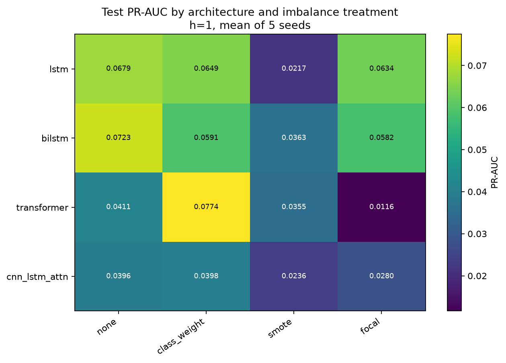
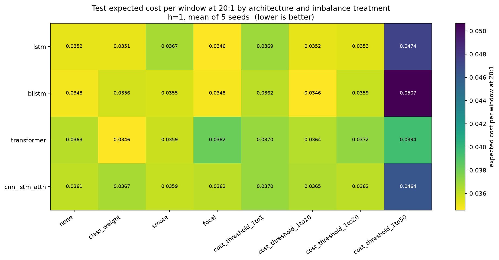
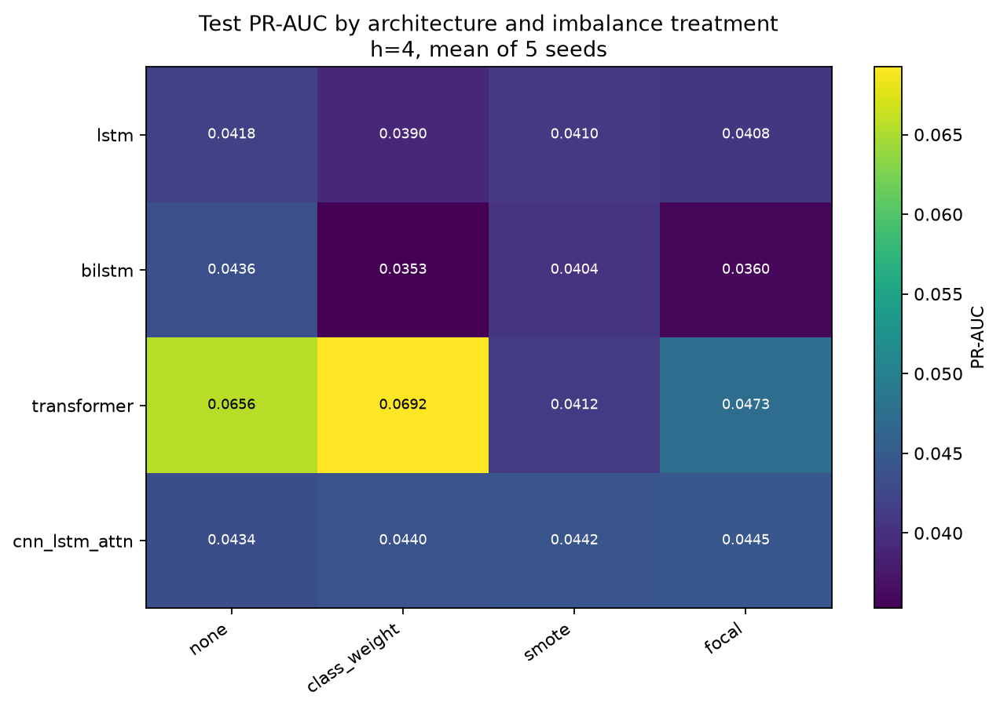
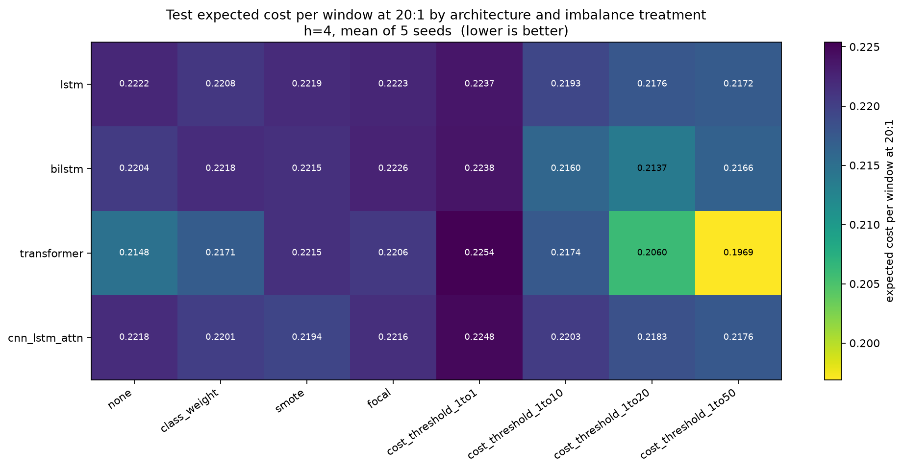
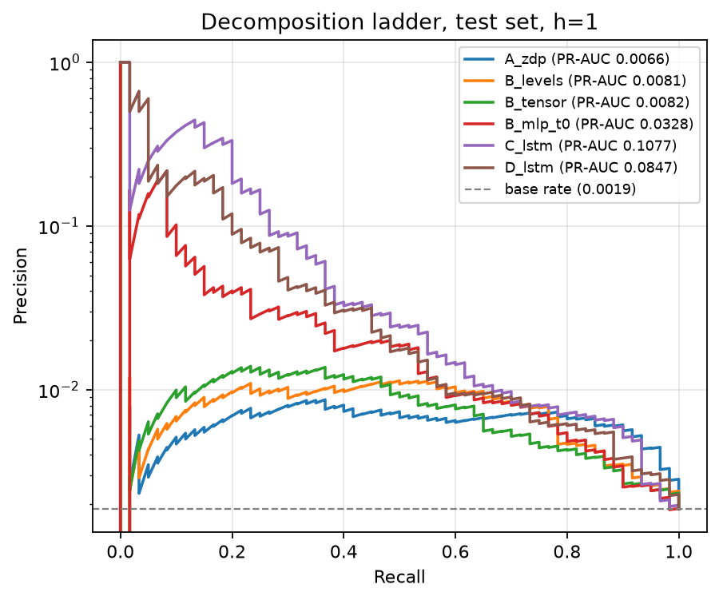
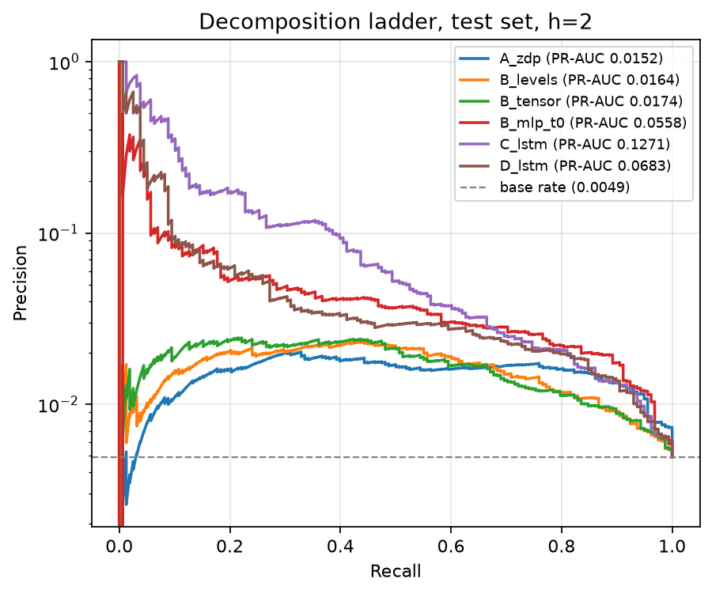
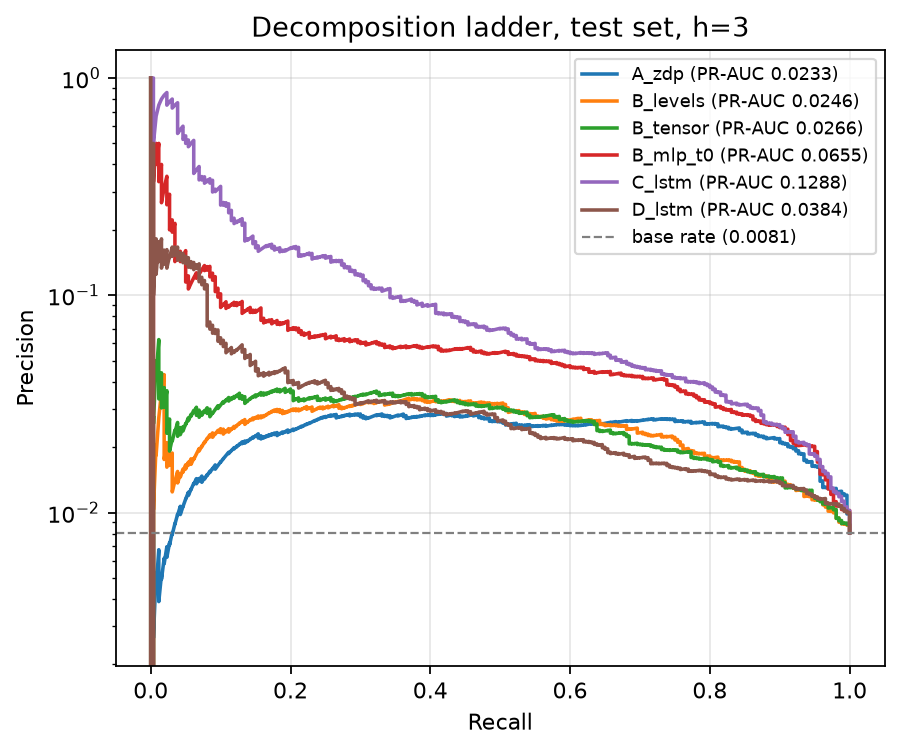
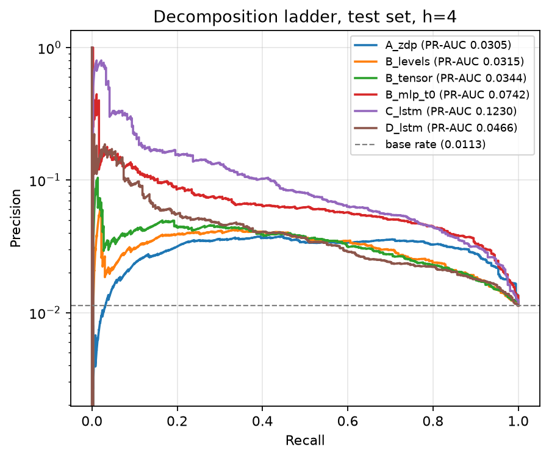
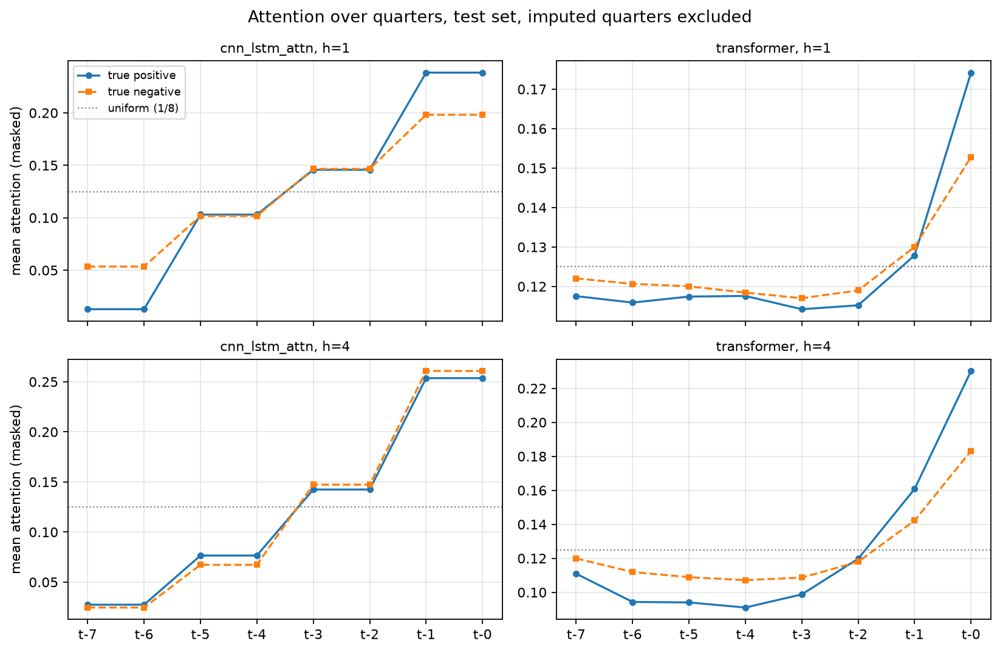
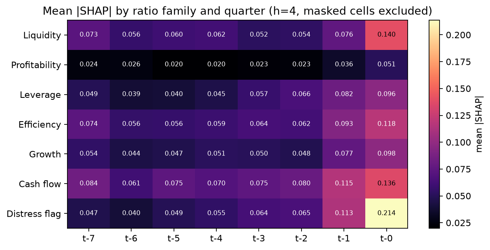

# Results

Every table below is generated from a CSV in `results/` by `src/report.py`.
No number in this file is typed by hand.

- Universe: **full**
- Dataset repository SHA: `b16eb17`
- Models repository SHA: `85c3df3`
- Seeds: `[0, 1, 2, 3, 4]`; deep results are mean ± std over 5 seeds unless stated otherwise.
- Generated: 2026-09-25T05:49:37
- Total measured compute: **14.61 h** over 315 cached deep runs plus the logged tuning trials.

## Changes from previous run

Every watched number whose relative change exceeded 10%, old against new.  3,930 numbers watched, 840 newly added this run.

**4 numbers moved.**

| file | row | metric | old | new | rel_change |
|---|---|---|---|---|---|
| decomposition_all.csv | 4 / C_lstm | pr_auc_diff | 0.0886 | 0.0488 | 0.4499 |
| decomposition_all.csv | 3 / C_lstm | pr_auc_diff | 0.1022 | 0.0633 | 0.3805 |
| decomposition_all.csv | 2 / C_lstm | pr_auc_diff | 0.1097 | 0.0713 | 0.3498 |
| decomposition_all.csv | 1 / C_lstm | pr_auc_diff | 0.0995 | 0.0749 | 0.2473 |

Read PR-AUC first.  At a window-level positive rate of roughly 1% (0.18% at
h=1) ROC-AUC flatters every model, which is exactly the point Contribution 5
makes about the published literature.

## 1. Data and the row-set contract

| split | windows | firms | positive_firms | pos_y1 | rate_y1 | pos_y2 | rate_y2 | pos_y3 | rate_y3 | pos_y4 | rate_y4 |
|---|---|---|---|---|---|---|---|---|---|---|---|
| train | 86592 | 4953 | 450 | 154 | 0.00178 | 410 | 0.00473 | 693 | 0.00800 | 986 | 0.01139 |
| val | 20844 | 3028 | 152 | 37 | 0.00178 | 71 | 0.00341 | 92 | 0.00441 | 108 | 0.00518 |
| test | 32216 | 3391 | 127 | 60 | 0.00186 | 158 | 0.00490 | 260 | 0.00807 | 363 | 0.01127 |

`results/row_sets.csv` holds **139,652** windows with no duplicate
`(cik, end_quarter)` pair.  Every model in this report — classical, machine
learning and deep — is scored on exactly these rows.

## 2. Classical and machine-learning baselines

### Horizon h = 1

| model | family | val_roc_auc | val_pr_auc | roc_auc | pr_auc | f1 | recall | specificity | precision | threshold | cost_1to1 | cost_1to10 | cost_1to20 | cost_1to50 |
|---|---|---|---|---|---|---|---|---|---|---|---|---|---|---|
| altman_zdp | formula | 0.8112 | 0.0047 | 0.8450 | 0.0066 | 0.0121 | 0.8667 | 0.7353 | 0.0061 | 2.0156 | 0.2645 | 0.2667 | 0.2692 | 0.2767 |
| altman_zp | formula | 0.7720 | 0.0039 | 0.7936 | 0.0057 | 0.0105 | 0.7833 | 0.7258 | 0.0053 | -0.0477 | 0.2741 | 0.2778 | 0.2818 | 0.2939 |
| ohlson_o | formula | 0.8260 | 0.0052 | 0.8643 | 0.0077 | 0.0153 | 0.6500 | 0.8441 | 0.0077 | -2.3698 | 0.1563 | 0.1621 | 0.1686 | 0.1882 |
| zmijewski | formula | 0.8424 | 0.0064 | 0.8744 | 0.0090 | 0.0198 | 0.8167 | 0.8496 | 0.0100 | 2.2860 | 0.1505 | 0.1536 | 0.1570 | 0.1672 |
| logreg | ml | 0.9024 | 0.0249 | 0.7779 | 0.0241 | 0.0638 | 0.2333 | 0.9886 | 0.0369 | 0.9929 | 0.0128 | 0.0256 | 0.0399 | 0.0827 |
| svm_rbf | ml | 0.9037 | 0.0214 | 0.8303 | 0.0173 | 0.0493 | 0.2833 | 0.9809 | 0.0270 | 0.9288 | 0.0204 | 0.0324 | 0.0457 | 0.0858 |
| random_forest | ml | 0.9285 | 0.1574 | 0.8750 | 0.0984 | 0.1786 | 0.1667 | 0.9987 | 0.1923 | 0.3497 | 0.0029 | 0.0168 | 0.0323 | 0.0789 |
| xgboost | ml | 0.9195 | 0.2499 | 0.8484 | 0.1406 | 0.1948 | 0.2500 | 0.9975 | 0.1596 | 0.0593 | 0.0038 | 0.0164 | 0.0304 | 0.0723 |
| stacking | ml | 0.9373 | 0.1739 | 0.8940 | 0.1048 | 0.1616 | 0.1333 | 0.9990 | 0.2051 | 1.0000 | 0.0026 | 0.0171 | 0.0332 | 0.0817 |

### Horizon h = 2

| model | family | val_roc_auc | val_pr_auc | roc_auc | pr_auc | f1 | recall | specificity | precision | threshold | cost_1to1 | cost_1to10 | cost_1to20 | cost_1to50 |
|---|---|---|---|---|---|---|---|---|---|---|---|---|---|---|
| altman_zdp | formula | 0.8073 | 0.0086 | 0.8299 | 0.0152 | 0.0303 | 0.8354 | 0.7369 | 0.0154 | 2.0156 | 0.2626 | 0.2698 | 0.2779 | 0.3021 |
| altman_zp | formula | 0.7653 | 0.0072 | 0.7856 | 0.0137 | 0.0273 | 0.7595 | 0.7349 | 0.0139 | 0.0249 | 0.2650 | 0.2756 | 0.2874 | 0.3228 |
| ohlson_o | formula | 0.8191 | 0.0095 | 0.8535 | 0.0172 | 0.0369 | 0.8291 | 0.7878 | 0.0189 | -3.6946 | 0.2120 | 0.2196 | 0.2280 | 0.2531 |
| zmijewski | formula | 0.8309 | 0.0113 | 0.8631 | 0.0197 | 0.0460 | 0.7342 | 0.8512 | 0.0237 | 2.2860 | 0.1494 | 0.1611 | 0.1741 | 0.2132 |
| logreg | ml | 0.8894 | 0.0321 | 0.8403 | 0.0383 | 0.0886 | 0.2089 | 0.9827 | 0.0562 | 0.9679 | 0.0211 | 0.0560 | 0.0948 | 0.2112 |
| svm_rbf | ml | 0.8937 | 0.0330 | 0.8805 | 0.0370 | 0.0870 | 0.3228 | 0.9699 | 0.0502 | 0.9484 | 0.0332 | 0.0631 | 0.0963 | 0.1960 |
| random_forest | ml | 0.9036 | 0.1716 | 0.8828 | 0.0977 | 0.1368 | 0.1329 | 0.9960 | 0.1409 | 0.2314 | 0.0082 | 0.0465 | 0.0890 | 0.2166 |
| xgboost | ml | 0.9033 | 0.2980 | 0.9028 | 0.1157 | 0.1922 | 0.1709 | 0.9970 | 0.2195 | 0.1668 | 0.0070 | 0.0436 | 0.0843 | 0.2063 |
| stacking | ml | 0.9234 | 0.2313 | 0.9002 | 0.1135 | 0.1374 | 0.1139 | 0.9973 | 0.1731 | 0.9999 | 0.0070 | 0.0461 | 0.0896 | 0.2200 |

### Horizon h = 3

| model | family | val_roc_auc | val_pr_auc | roc_auc | pr_auc | f1 | recall | specificity | precision | threshold | cost_1to1 | cost_1to10 | cost_1to20 | cost_1to50 |
|---|---|---|---|---|---|---|---|---|---|---|---|---|---|---|
| altman_zdp | formula | 0.7995 | 0.0109 | 0.8224 | 0.0233 | 0.0483 | 0.8192 | 0.7386 | 0.0249 | 2.0156 | 0.2607 | 0.2738 | 0.2884 | 0.3322 |
| altman_zp | formula | 0.7607 | 0.0093 | 0.7793 | 0.0215 | 0.0451 | 0.7577 | 0.7410 | 0.0233 | 0.0776 | 0.2588 | 0.2764 | 0.2960 | 0.3547 |
| ohlson_o | formula | 0.8095 | 0.0119 | 0.8482 | 0.0263 | 0.0564 | 0.7808 | 0.7893 | 0.0293 | -3.6946 | 0.2107 | 0.2267 | 0.2444 | 0.2974 |
| zmijewski | formula | 0.8189 | 0.0139 | 0.8545 | 0.0295 | 0.0688 | 0.6808 | 0.8526 | 0.0362 | 2.2860 | 0.1487 | 0.1719 | 0.1977 | 0.2750 |
| logreg | ml | 0.8699 | 0.0305 | 0.8282 | 0.0518 | 0.1145 | 0.3154 | 0.9659 | 0.0700 | 0.9159 | 0.0394 | 0.0891 | 0.1443 | 0.3101 |
| svm_rbf | ml | 0.8777 | 0.0385 | 0.8707 | 0.0609 | 0.1478 | 0.2038 | 0.9874 | 0.1160 | 0.9981 | 0.0190 | 0.0768 | 0.1410 | 0.3338 |
| random_forest | ml | 0.9297 | 0.1658 | 0.8778 | 0.0893 | 0.1451 | 0.1269 | 0.9949 | 0.1692 | 0.2795 | 0.0121 | 0.0755 | 0.1460 | 0.3573 |
| xgboost | ml | 0.9109 | 0.2903 | 0.8989 | 0.1355 | 0.1901 | 0.1692 | 0.9950 | 0.2167 | 0.3407 | 0.0116 | 0.0720 | 0.1390 | 0.3402 |
| stacking | ml | 0.9231 | 0.2305 | 0.8958 | 0.1166 | 0.1618 | 0.1385 | 0.9953 | 0.1946 | 0.9997 | 0.0116 | 0.0742 | 0.1437 | 0.3523 |

### Horizon h = 4

| model | family | val_roc_auc | val_pr_auc | roc_auc | pr_auc | f1 | recall | specificity | precision | threshold | cost_1to1 | cost_1to10 | cost_1to20 | cost_1to50 |
|---|---|---|---|---|---|---|---|---|---|---|---|---|---|---|
| altman_zdp | formula | 0.8017 | 0.0130 | 0.8122 | 0.0305 | 0.0641 | 0.7879 | 0.7401 | 0.0334 | 2.0156 | 0.2594 | 0.2809 | 0.3048 | 0.3765 |
| altman_zp | formula | 0.7650 | 0.0111 | 0.7723 | 0.0285 | 0.0600 | 0.7300 | 0.7423 | 0.0313 | 0.0776 | 0.2578 | 0.2852 | 0.3156 | 0.4069 |
| ohlson_o | formula | 0.8059 | 0.0140 | 0.8402 | 0.0343 | 0.0742 | 0.5785 | 0.8402 | 0.0396 | -2.5766 | 0.1627 | 0.2055 | 0.2530 | 0.3955 |
| zmijewski | formula | 0.8092 | 0.0160 | 0.8413 | 0.0377 | 0.0865 | 0.6253 | 0.8537 | 0.0465 | 2.2860 | 0.1488 | 0.1868 | 0.2290 | 0.3557 |
| logreg | ml | 0.8617 | 0.0314 | 0.8330 | 0.0595 | 0.1174 | 0.2727 | 0.9615 | 0.0748 | 0.8924 | 0.0462 | 0.1200 | 0.2019 | 0.4478 |
| svm_rbf | ml | 0.8500 | 0.0393 | 0.7939 | 0.0467 | 0.1067 | 0.1543 | 0.9802 | 0.0815 | 0.9735 | 0.0291 | 0.1149 | 0.2102 | 0.4961 |
| random_forest | ml | 0.9168 | 0.1837 | 0.8798 | 0.1028 | 0.1248 | 0.0937 | 0.9954 | 0.1868 | 0.3431 | 0.0148 | 0.1067 | 0.2088 | 0.5152 |
| xgboost | ml | 0.9060 | 0.3295 | 0.8925 | 0.1485 | 0.1442 | 0.1019 | 0.9965 | 0.2467 | 0.4294 | 0.0136 | 0.1047 | 0.2059 | 0.5095 |
| stacking | ml | 0.9168 | 0.2443 | 0.8865 | 0.1224 | 0.1734 | 0.1488 | 0.9935 | 0.2077 | 0.9994 | 0.0160 | 0.1023 | 0.1982 | 0.4860 |

### Altman at its canonical cutoffs

Threshold-free AUCs above are the fair reading; this is how the score is
actually used in practice.

| model | horizon | rule | cut_distress | cut_safe | tp | fp | fn | tn | precision | recall | specificity | f1 | accuracy | alarm_rate |
|---|---|---|---|---|---|---|---|---|---|---|---|---|---|---|
| altman_zdp | 1 | distress_only | 1.1000 | 2.6000 | 58 | 14219 | 2 | 17937 | 0.0041 | 0.9667 | 0.5578 | 0.0081 | 0.5586 | 0.4432 |
| altman_zdp | 1 | distress_or_grey | 1.1000 | 2.6000 | 59 | 19571 | 1 | 12585 | 0.0030 | 0.9833 | 0.3914 | 0.0060 | 0.3925 | 0.6093 |
| altman_zp | 1 | distress_only | 1.2300 | 2.9000 | 55 | 16570 | 5 | 15586 | 0.0033 | 0.9167 | 0.4847 | 0.0066 | 0.4855 | 0.5160 |
| altman_zp | 1 | distress_or_grey | 1.2300 | 2.9000 | 59 | 27966 | 1 | 4190 | 0.0021 | 0.9833 | 0.1303 | 0.0042 | 0.1319 | 0.8699 |
| altman_zdp | 2 | distress_only | 1.1000 | 2.6000 | 151 | 14126 | 7 | 17932 | 0.0106 | 0.9557 | 0.5594 | 0.0209 | 0.5613 | 0.4432 |
| altman_zdp | 2 | distress_or_grey | 1.1000 | 2.6000 | 154 | 19476 | 4 | 12582 | 0.0078 | 0.9747 | 0.3925 | 0.0156 | 0.3953 | 0.6093 |
| altman_zp | 2 | distress_only | 1.2300 | 2.9000 | 141 | 16484 | 17 | 15574 | 0.0085 | 0.8924 | 0.4858 | 0.0168 | 0.4878 | 0.5160 |
| altman_zp | 2 | distress_or_grey | 1.2300 | 2.9000 | 156 | 27869 | 2 | 4189 | 0.0056 | 0.9873 | 0.1307 | 0.0111 | 0.1349 | 0.8699 |
| altman_zdp | 3 | distress_only | 1.1000 | 2.6000 | 244 | 14033 | 16 | 17923 | 0.0171 | 0.9385 | 0.5609 | 0.0336 | 0.5639 | 0.4432 |
| altman_zdp | 3 | distress_or_grey | 1.1000 | 2.6000 | 253 | 19377 | 7 | 12579 | 0.0129 | 0.9731 | 0.3936 | 0.0254 | 0.3983 | 0.6093 |
| altman_zp | 3 | distress_only | 1.2300 | 2.9000 | 231 | 16394 | 29 | 15562 | 0.0139 | 0.8885 | 0.4870 | 0.0274 | 0.4902 | 0.5160 |
| altman_zp | 3 | distress_or_grey | 1.2300 | 2.9000 | 255 | 27770 | 5 | 4186 | 0.0091 | 0.9808 | 0.1310 | 0.0180 | 0.1379 | 0.8699 |
| altman_zdp | 4 | distress_only | 1.1000 | 2.6000 | 338 | 13939 | 25 | 17914 | 0.0237 | 0.9311 | 0.5624 | 0.0462 | 0.5666 | 0.4432 |
| altman_zdp | 4 | distress_or_grey | 1.1000 | 2.6000 | 351 | 19279 | 12 | 12574 | 0.0179 | 0.9669 | 0.3948 | 0.0351 | 0.4012 | 0.6093 |
| altman_zp | 4 | distress_only | 1.2300 | 2.9000 | 321 | 16304 | 42 | 15549 | 0.0193 | 0.8843 | 0.4881 | 0.0378 | 0.4926 | 0.5160 |
| altman_zp | 4 | distress_or_grey | 1.2300 | 2.9000 | 355 | 27670 | 8 | 4183 | 0.0127 | 0.9780 | 0.1313 | 0.0250 | 0.1409 | 0.8699 |

### Where the classical inputs came from

- Trailing-four-quarter sums replace quarterly flows for Altman X3/X5, Ohlson NI/TA and FFO/TL, and Zmijewski NI/TA.
- The `x4` fallback (fewer than four contiguous prior quarters) was used on {'Revenue': 1640, 'EBIT': 1460, 'NetIncomeLoss': 1066, 'OCF': 2029} of the 139652 evaluated windows.
- Total liabilities came from the accounting identity on 446 panel rows where the tag was absent.
- Missing classical variables are filled with the **train** median (fitted on 86,592 train rows).

## 3. The four temporal architectures

| architecture | n_parameters | n_features | n_outputs |
|---|---|---|---|
| lstm | 37409 | 29 | 1 |
| bilstm | 52801 | 29 | 1 |
| transformer | 70977 | 29 | 1 |
| cnn_lstm_attn | 31073 | 29 | 1 |

Hyperparameters were searched on validation PR-AUC only, with an identical
budget of 30 random-search trials per architecture.
Trial 0 is the specification's own defaults, so the search can only improve
on the spec.

| architecture | lr | batch_size | dropout | weight_decay | best_val_pr_auc | spec_default_val_pr_auc | n_trials |
|---|---|---|---|---|---|---|---|
| lstm | 0.00189 | 64 | 0.30000 | 0.00000 | 0.30811 | 0.18221 | 30 |
| bilstm | 0.00321 | 256 | 0.20000 | 0.00000 | 0.30832 | 0.17278 | 30 |
| transformer | 0.00132 | 32 | 0.40000 | 0.00010 | 0.18212 | 0.12013 | 30 |
| cnn_lstm_attn | 0.00287 | 64 | 0.30000 | 0.00000 | 0.21346 | 0.20017 | 30 |

### Horizon h = 1

| architecture | n_params | ROC-AUC | PR-AUC | F1 | recall | specificity | cost @ 1:20 | epochs |
|---|---|---|---|---|---|---|---|---|
| bilstm | 52801 | 0.7059 ± 0.0703 | 0.0591 ± 0.0272 | 0.0904 ± 0.0335 | 0.0800 ± 0.0431 | 0.9986 ± 0.0016 | 0.0356 ± 0.0009 | 19.60 |
| cnn_lstm_attn | 31073 | 0.7617 ± 0.0673 | 0.0398 ± 0.0211 | 0.0607 ± 0.0361 | 0.0733 ± 0.0608 | 0.9978 ± 0.0024 | 0.0367 ± 0.0011 | 23.40 |
| lstm | 37409 | 0.8329 ± 0.0303 | 0.0649 ± 0.0138 | 0.1024 ± 0.0183 | 0.0933 ± 0.0346 | 0.9987 ± 0.0011 | 0.0351 ± 0.0006 | 16.40 |
| transformer | 70977 | 0.8135 ± 0.0294 | 0.0774 ± 0.0296 | 0.1202 ± 0.0308 | 0.1033 ± 0.0321 | 0.9988 ± 0.0008 | 0.0346 ± 0.0011 | 31.00 |

### Horizon h = 2

| architecture | n_params | ROC-AUC | PR-AUC | F1 | recall | specificity | cost @ 1:20 | epochs |
|---|---|---|---|---|---|---|---|---|
| bilstm | 52801 | 0.7323 ± 0.0211 | 0.0339 ± 0.0090 | 0.0714 ± 0.0215 | 0.0519 ± 0.0144 | 0.9979 ± 0.0009 | 0.0951 ± 0.0017 | 25.00 |
| cnn_lstm_attn | 31073 | 0.8157 ± 0.0398 | 0.0389 ± 0.0125 | 0.0526 ± 0.0146 | 0.0354 ± 0.0096 | 0.9984 ± 0.0007 | 0.0962 ± 0.0011 | 24.80 |
| lstm | 37409 | 0.8045 ± 0.0558 | 0.0449 ± 0.0153 | 0.0648 ± 0.0260 | 0.0468 ± 0.0226 | 0.9983 ± 0.0011 | 0.0952 ± 0.0015 | 25.60 |
| transformer | 70977 | 0.8412 ± 0.0164 | 0.0788 ± 0.0163 | 0.1158 ± 0.0171 | 0.0810 ± 0.0113 | 0.9984 ± 0.0002 | 0.0917 ± 0.0012 | 31.80 |

### Horizon h = 3

| architecture | n_params | ROC-AUC | PR-AUC | F1 | recall | specificity | cost @ 1:20 | epochs |
|---|---|---|---|---|---|---|---|---|
| bilstm | 52801 | 0.7253 ± 0.0119 | 0.0334 ± 0.0052 | 0.0522 ± 0.0120 | 0.0369 ± 0.0111 | 0.9970 ± 0.0011 | 0.1584 ± 0.0014 | 28.60 |
| cnn_lstm_attn | 31073 | 0.7892 ± 0.0197 | 0.0385 ± 0.0062 | 0.0572 ± 0.0168 | 0.0469 ± 0.0245 | 0.9958 ± 0.0029 | 0.1580 ± 0.0014 | 28.40 |
| lstm | 37409 | 0.7652 ± 0.0202 | 0.0286 ± 0.0018 | 0.0419 ± 0.0151 | 0.0292 ± 0.0138 | 0.9974 ± 0.0012 | 0.1593 ± 0.0011 | 37.40 |
| transformer | 70977 | 0.8530 ± 0.0113 | 0.0763 ± 0.0161 | 0.0757 ± 0.0182 | 0.0469 ± 0.0126 | 0.9985 ± 0.0009 | 0.1553 ± 0.0018 | 32.80 |

### Horizon h = 4

| architecture | n_params | ROC-AUC | PR-AUC | F1 | recall | specificity | cost @ 1:20 | epochs |
|---|---|---|---|---|---|---|---|---|
| bilstm | 52801 | 0.7037 ± 0.0484 | 0.0353 ± 0.0067 | 0.0429 ± 0.0315 | 0.0303 ± 0.0250 | 0.9966 ± 0.0015 | 0.2218 ± 0.0043 | 31.00 |
| cnn_lstm_attn | 31073 | 0.7758 ± 0.0220 | 0.0440 ± 0.0060 | 0.0598 ± 0.0248 | 0.0441 ± 0.0194 | 0.9953 ± 0.0012 | 0.2201 ± 0.0039 | 26.80 |
| lstm | 37409 | 0.7440 ± 0.0259 | 0.0390 ± 0.0093 | 0.0530 ± 0.0229 | 0.0375 ± 0.0179 | 0.9961 ± 0.0019 | 0.2208 ± 0.0031 | 31.40 |
| transformer | 70977 | 0.8290 ± 0.0218 | 0.0692 ± 0.0122 | 0.0746 ± 0.0170 | 0.0490 ± 0.0153 | 0.9972 ± 0.0012 | 0.2171 ± 0.0023 | 32.20 |

### Multi-horizon head versus four single-horizon models

| arch | horizon | pr_auc_mean | pr_auc_std | single_pr_auc_mean | single_pr_auc_std | roc_auc_mean | single_roc_auc_mean | multi_beats_single_pr |
|---|---|---|---|---|---|---|---|---|
| bilstm | 1 | 0.0138 | 0.0049 | 0.0591 | 0.0272 | 0.7341 | 0.7059 | False |
| bilstm | 2 | 0.0242 | 0.0045 | 0.0339 | 0.0090 | 0.7462 | 0.7323 | False |
| bilstm | 3 | 0.0336 | 0.0066 | 0.0334 | 0.0052 | 0.7400 | 0.7253 | True |
| bilstm | 4 | 0.0425 | 0.0065 | 0.0353 | 0.0067 | 0.7412 | 0.7037 | True |
| cnn_lstm_attn | 1 | 0.0335 | 0.0127 | 0.0398 | 0.0211 | 0.8348 | 0.7617 | False |
| cnn_lstm_attn | 2 | 0.0339 | 0.0047 | 0.0389 | 0.0125 | 0.8186 | 0.8157 | False |
| cnn_lstm_attn | 3 | 0.0422 | 0.0055 | 0.0385 | 0.0062 | 0.8060 | 0.7892 | True |
| cnn_lstm_attn | 4 | 0.0491 | 0.0069 | 0.0440 | 0.0060 | 0.7938 | 0.7758 | True |
| lstm | 1 | 0.0157 | 0.0094 | 0.0649 | 0.0138 | 0.7682 | 0.8329 | False |
| lstm | 2 | 0.0212 | 0.0067 | 0.0449 | 0.0153 | 0.7496 | 0.8045 | False |
| lstm | 3 | 0.0284 | 0.0070 | 0.0286 | 0.0018 | 0.7408 | 0.7652 | False |
| lstm | 4 | 0.0356 | 0.0077 | 0.0390 | 0.0093 | 0.7307 | 0.7440 | False |
| transformer | 1 | 0.0667 | 0.0154 | 0.0774 | 0.0296 | 0.8802 | 0.8135 | False |
| transformer | 2 | 0.0612 | 0.0129 | 0.0788 | 0.0163 | 0.8698 | 0.8412 | False |
| transformer | 3 | 0.0698 | 0.0123 | 0.0763 | 0.0161 | 0.8642 | 0.8530 | False |
| transformer | 4 | 0.0762 | 0.0109 | 0.0692 | 0.0122 | 0.8561 | 0.8290 | True |

### Structural-indicator ablation

Three of the 29 ratios are undefined for firms without inventory and one for
firms without debt.  This run feeds `has_inventory` and `has_debt` as two
extra input channels so the model can tell 'not applicable' from 'missing'.

| arch | horizon | pr_auc_mean | pr_auc_std | roc_auc_mean | roc_auc_std | n_seeds | inputs | ratios_only_pr_auc_mean | ratios_only_pr_auc_std | ratios_only_roc_auc_mean | ratios_only_roc_auc_std | indicators_help_pr |
|---|---|---|---|---|---|---|---|---|---|---|---|---|
| transformer | 1 | 0.0599 | 0.0135 | 0.7976 | 0.0458 | 5 | 29 ratios + 2 indicators | 0.0774 | 0.0296 | 0.8135 | 0.0294 | False |
| transformer | 4 | 0.0662 | 0.0049 | 0.8403 | 0.0146 | 5 | 29 ratios + 2 indicators | 0.0692 | 0.0122 | 0.8290 | 0.0218 | False |

## 4. Imbalance ablation

### Horizon h = 1

| architecture | treatment | ROC-AUC | PR-AUC | F1 | recall | specificity | cost 1:1 | cost 1:10 | cost 1:20 | cost 1:50 |
|---|---|---|---|---|---|---|---|---|---|---|
| bilstm | class_weight | 0.7059 ± 0.0703 | 0.0591 ± 0.0272 | 0.0904 ± 0.0335 | 0.0800 ± 0.0431 | 0.9986 ± 0.0016 | 0.0031 ± 0.0016 | 0.0185 ± 0.0010 | 0.0356 ± 0.0009 | 0.0870 ± 0.0028 |
| bilstm | cost_threshold_1to1 | 0.7476 ± 0.0790 | 0.0723 ± 0.0148 | 0.0557 ± 0.0330 | 0.0300 ± 0.0183 | 1.0000 ± 0.0001 | 0.0019 ± 0.0000 | 0.0181 ± 0.0003 | 0.0362 ± 0.0006 | 0.0904 ± 0.0017 |
| bilstm | cost_threshold_1to10 | 0.7476 ± 0.0790 | 0.0723 ± 0.0148 | 0.1147 ± 0.0200 | 0.1133 ± 0.0477 | 0.9984 ± 0.0013 | 0.0032 ± 0.0012 | 0.0181 ± 0.0006 | 0.0346 ± 0.0008 | 0.0842 ± 0.0033 |
| bilstm | cost_threshold_1to20 | 0.7476 ± 0.0790 | 0.0723 ± 0.0148 | 0.0936 ± 0.0270 | 0.1533 ± 0.0519 | 0.9956 ± 0.0029 | 0.0059 ± 0.0028 | 0.0201 ± 0.0023 | 0.0359 ± 0.0019 | 0.0832 ± 0.0032 |
| bilstm | cost_threshold_1to50 | 0.7476 ± 0.0790 | 0.0723 ± 0.0148 | 0.0431 ± 0.0083 | 0.2833 ± 0.1184 | 0.9760 ± 0.0127 | 0.0253 ± 0.0125 | 0.0373 ± 0.0105 | 0.0507 ± 0.0084 | 0.0907 ± 0.0022 |
| bilstm | focal | 0.7442 ± 0.0560 | 0.0582 ± 0.0093 | 0.1157 ± 0.0367 | 0.1100 ± 0.0384 | 0.9984 ± 0.0013 | 0.0033 ± 0.0012 | 0.0182 ± 0.0010 | 0.0348 ± 0.0011 | 0.0845 ± 0.0029 |
| bilstm | none | 0.7476 ± 0.0790 | 0.0723 ± 0.0148 | 0.1098 ± 0.0248 | 0.0967 ± 0.0462 | 0.9988 ± 0.0010 | 0.0029 ± 0.0010 | 0.0180 ± 0.0005 | 0.0348 ± 0.0009 | 0.0853 ± 0.0034 |
| bilstm | smote | 0.7621 ± 0.0381 | 0.0363 ± 0.0109 | 0.0896 ± 0.0181 | 0.0867 ± 0.0274 | 0.9985 ± 0.0005 | 0.0032 ± 0.0004 | 0.0185 ± 0.0002 | 0.0355 ± 0.0006 | 0.0866 ± 0.0021 |
| cnn_lstm_attn | class_weight | 0.7617 ± 0.0673 | 0.0398 ± 0.0211 | 0.0607 ± 0.0361 | 0.0733 ± 0.0608 | 0.9978 ± 0.0024 | 0.0039 ± 0.0023 | 0.0194 ± 0.0014 | 0.0367 ± 0.0011 | 0.0884 ± 0.0037 |
| cnn_lstm_attn | cost_threshold_1to1 | 0.8353 ± 0.0355 | 0.0396 ± 0.0069 | 0.0129 ± 0.0177 | 0.0067 ± 0.0091 | 1.0000 ± 0.0000 | 0.0019 ± 0.0000 | 0.0185 ± 0.0002 | 0.0370 ± 0.0004 | 0.0925 ± 0.0009 |
| cnn_lstm_attn | cost_threshold_1to10 | 0.8353 ± 0.0355 | 0.0396 ± 0.0069 | 0.0432 ± 0.0356 | 0.0333 ± 0.0391 | 0.9995 ± 0.0008 | 0.0023 ± 0.0007 | 0.0185 ± 0.0002 | 0.0365 ± 0.0007 | 0.0905 ± 0.0029 |
| cnn_lstm_attn | cost_threshold_1to20 | 0.8353 ± 0.0355 | 0.0396 ± 0.0069 | 0.0751 ± 0.0151 | 0.0867 ± 0.0361 | 0.9978 ± 0.0013 | 0.0039 ± 0.0013 | 0.0192 ± 0.0008 | 0.0362 ± 0.0005 | 0.0872 ± 0.0022 |
| cnn_lstm_attn | cost_threshold_1to50 | 0.8353 ± 0.0355 | 0.0396 ± 0.0069 | 0.0515 ± 0.0194 | 0.2667 ± 0.0601 | 0.9809 ± 0.0084 | 0.0204 ± 0.0084 | 0.0327 ± 0.0080 | 0.0464 ± 0.0077 | 0.0873 ± 0.0078 |
| cnn_lstm_attn | focal | 0.7948 ± 0.0174 | 0.0280 ± 0.0059 | 0.0687 ± 0.0271 | 0.0667 ± 0.0373 | 0.9986 ± 0.0008 | 0.0031 ± 0.0008 | 0.0188 ± 0.0003 | 0.0362 ± 0.0007 | 0.0883 ± 0.0027 |
| cnn_lstm_attn | none | 0.8353 ± 0.0355 | 0.0396 ± 0.0069 | 0.0749 ± 0.0151 | 0.0800 ± 0.0321 | 0.9981 ± 0.0010 | 0.0036 ± 0.0010 | 0.0190 ± 0.0006 | 0.0361 ± 0.0005 | 0.0875 ± 0.0021 |
| cnn_lstm_attn | smote | 0.7539 ± 0.0624 | 0.0236 ± 0.0077 | 0.0748 ± 0.0430 | 0.0700 ± 0.0477 | 0.9987 ± 0.0007 | 0.0030 ± 0.0006 | 0.0186 ± 0.0007 | 0.0359 ± 0.0014 | 0.0879 ± 0.0041 |
| lstm | class_weight | 0.8329 ± 0.0303 | 0.0649 ± 0.0138 | 0.1024 ± 0.0183 | 0.0933 ± 0.0346 | 0.9987 ± 0.0011 | 0.0030 ± 0.0010 | 0.0182 ± 0.0006 | 0.0351 ± 0.0006 | 0.0858 ± 0.0023 |
| lstm | cost_threshold_1to1 | 0.8001 ± 0.0673 | 0.0679 ± 0.0241 | 0.0224 ± 0.0220 | 0.0133 ± 0.0139 | 0.9998 ± 0.0002 | 0.0020 ± 0.0002 | 0.0185 ± 0.0001 | 0.0369 ± 0.0003 | 0.0920 ± 0.0011 |
| lstm | cost_threshold_1to10 | 0.8001 ± 0.0673 | 0.0679 ± 0.0241 | 0.1015 ± 0.0363 | 0.0933 ± 0.0560 | 0.9986 ± 0.0018 | 0.0031 ± 0.0017 | 0.0183 ± 0.0010 | 0.0352 ± 0.0009 | 0.0858 ± 0.0037 |
| lstm | cost_threshold_1to20 | 0.8001 ± 0.0673 | 0.0679 ± 0.0241 | 0.1050 ± 0.0360 | 0.1700 ± 0.0431 | 0.9956 ± 0.0027 | 0.0060 ± 0.0027 | 0.0199 ± 0.0024 | 0.0353 ± 0.0024 | 0.0817 ± 0.0036 |
| lstm | cost_threshold_1to50 | 0.8001 ± 0.0673 | 0.0679 ± 0.0241 | 0.0492 ± 0.0111 | 0.3000 ± 0.0514 | 0.9786 ± 0.0070 | 0.0226 ± 0.0069 | 0.0344 ± 0.0065 | 0.0474 ± 0.0062 | 0.0865 ± 0.0062 |
| lstm | focal | 0.7871 ± 0.0412 | 0.0634 ± 0.0177 | 0.1152 ± 0.0256 | 0.1067 ± 0.0480 | 0.9987 ± 0.0008 | 0.0029 ± 0.0008 | 0.0179 ± 0.0004 | 0.0346 ± 0.0011 | 0.0845 ± 0.0037 |
| lstm | none | 0.8001 ± 0.0673 | 0.0679 ± 0.0241 | 0.1015 ± 0.0363 | 0.0933 ± 0.0560 | 0.9986 ± 0.0018 | 0.0031 ± 0.0017 | 0.0183 ± 0.0010 | 0.0352 ± 0.0009 | 0.0858 ± 0.0037 |
| lstm | smote | 0.7499 ± 0.0324 | 0.0217 ± 0.0114 | 0.0504 ± 0.0200 | 0.0367 ± 0.0139 | 0.9992 ± 0.0002 | 0.0026 ± 0.0002 | 0.0188 ± 0.0004 | 0.0367 ± 0.0007 | 0.0905 ± 0.0014 |
| transformer | class_weight | 0.8135 ± 0.0294 | 0.0774 ± 0.0296 | 0.1202 ± 0.0308 | 0.1033 ± 0.0321 | 0.9988 ± 0.0008 | 0.0029 ± 0.0007 | 0.0179 ± 0.0007 | 0.0346 ± 0.0011 | 0.0847 ± 0.0027 |
| transformer | cost_threshold_1to1 | 0.8076 ± 0.0594 | 0.0411 ± 0.0362 | 0.0130 ± 0.0178 | 0.0067 ± 0.0091 | 1.0000 ± 0.0000 | 0.0019 ± 0.0001 | 0.0185 ± 0.0002 | 0.0370 ± 0.0004 | 0.0925 ± 0.0009 |
| transformer | cost_threshold_1to10 | 0.8076 ± 0.0594 | 0.0411 ± 0.0362 | 0.0538 ± 0.0652 | 0.0433 ± 0.0573 | 0.9993 ± 0.0007 | 0.0025 ± 0.0006 | 0.0186 ± 0.0009 | 0.0364 ± 0.0018 | 0.0898 ± 0.0050 |
| transformer | cost_threshold_1to20 | 0.8076 ± 0.0594 | 0.0411 ± 0.0362 | 0.0629 ± 0.0496 | 0.1067 ± 0.0787 | 0.9961 ± 0.0026 | 0.0055 ± 0.0026 | 0.0205 ± 0.0025 | 0.0372 ± 0.0032 | 0.0871 ± 0.0069 |
| transformer | cost_threshold_1to50 | 0.8076 ± 0.0594 | 0.0411 ± 0.0362 | 0.0505 ± 0.0386 | 0.1500 ± 0.1439 | 0.9922 ± 0.0084 | 0.0094 ± 0.0081 | 0.0236 ± 0.0061 | 0.0394 ± 0.0043 | 0.0869 ± 0.0070 |
| transformer | focal | 0.8115 ± 0.0190 | 0.0116 ± 0.0016 | 0.0167 ± 0.0239 | 0.0200 ± 0.0274 | 0.9983 ± 0.0013 | 0.0035 ± 0.0012 | 0.0199 ± 0.0009 | 0.0382 ± 0.0008 | 0.0929 ± 0.0018 |
| transformer | none | 0.8076 ± 0.0594 | 0.0411 ± 0.0362 | 0.0583 ± 0.0588 | 0.0767 ± 0.0760 | 0.9981 ± 0.0017 | 0.0036 ± 0.0015 | 0.0191 ± 0.0009 | 0.0363 ± 0.0017 | 0.0879 ± 0.0057 |
| transformer | smote | 0.7354 ± 0.0404 | 0.0355 ± 0.0072 | 0.0771 ± 0.0270 | 0.0900 ± 0.0596 | 0.9980 ± 0.0018 | 0.0037 ± 0.0017 | 0.0189 ± 0.0008 | 0.0359 ± 0.0006 | 0.0867 ± 0.0038 |

PR-AUC is threshold-free, so only the four training treatments can move it.
The cost-sensitive threshold changes where the untreated model's ranking is
cut, which shows up in expected cost rather than in PR-AUC:

Read from `imbalance_ablation_h1.csv`, per architecture, because the untreated baseline is not the same number across architectures:

- **bilstm**: untreated PR-AUC 0.0723; best training-side treatment is class_weight at 0.0591 (-0.0132); class_weight, smote, focal reduce it.  Lowest expected cost at 50:1 comes from `cost_threshold_1to20` (0.0832).
- **cnn_lstm_attn**: untreated PR-AUC 0.0396; best training-side treatment is class_weight at 0.0398 (+0.0002); smote, focal reduce it.  Lowest expected cost at 50:1 comes from `cost_threshold_1to20` (0.0872).
- **lstm**: untreated PR-AUC 0.0679; best training-side treatment is class_weight at 0.0649 (-0.0029); class_weight, smote, focal reduce it.  Lowest expected cost at 50:1 comes from `cost_threshold_1to20` (0.0817).
- **transformer**: untreated PR-AUC 0.0411; best training-side treatment is class_weight at 0.0774 (+0.0363); smote, focal reduce it.  Lowest expected cost at 50:1 comes from `class_weight` (0.0847).

The `cost_threshold_*` rows share the untreated model's ranking and differ only in where it is cut, so their PR-AUC is identical to `none` by construction; they move expected cost, not PR-AUC.

### Horizon h = 4

| architecture | treatment | ROC-AUC | PR-AUC | F1 | recall | specificity | cost 1:1 | cost 1:10 | cost 1:20 | cost 1:50 |
|---|---|---|---|---|---|---|---|---|---|---|
| bilstm | class_weight | 0.7037 ± 0.0484 | 0.0353 ± 0.0067 | 0.0429 ± 0.0315 | 0.0303 ± 0.0250 | 0.9966 ± 0.0015 | 0.0142 ± 0.0012 | 0.1126 ± 0.0015 | 0.2218 ± 0.0043 | 0.5496 ± 0.0127 |
| bilstm | cost_threshold_1to1 | 0.7405 ± 0.0243 | 0.0436 ± 0.0056 | 0.0185 ± 0.0058 | 0.0099 ± 0.0031 | 0.9993 ± 0.0002 | 0.0118 ± 0.0002 | 0.1122 ± 0.0004 | 0.2238 ± 0.0007 | 0.5585 ± 0.0017 |
| bilstm | cost_threshold_1to10 | 0.7405 ± 0.0243 | 0.0436 ± 0.0056 | 0.0869 ± 0.0080 | 0.0821 ± 0.0060 | 0.9907 ± 0.0020 | 0.0195 ± 0.0019 | 0.1126 ± 0.0018 | 0.2160 ± 0.0019 | 0.5263 ± 0.0032 |
| bilstm | cost_threshold_1to20 | 0.7405 ± 0.0243 | 0.0436 ± 0.0056 | 0.0960 ± 0.0064 | 0.1295 ± 0.0367 | 0.9822 ± 0.0075 | 0.0274 ± 0.0070 | 0.1156 ± 0.0035 | 0.2137 ± 0.0018 | 0.5080 ± 0.0135 |
| bilstm | cost_threshold_1to50 | 0.7405 ± 0.0243 | 0.0436 ± 0.0056 | 0.0926 ± 0.0135 | 0.1774 ± 0.0380 | 0.9684 ± 0.0138 | 0.0405 ± 0.0133 | 0.1239 ± 0.0100 | 0.2166 ± 0.0072 | 0.4947 ± 0.0111 |
| bilstm | focal | 0.7232 ± 0.0280 | 0.0360 ± 0.0045 | 0.0395 ± 0.0115 | 0.0259 ± 0.0088 | 0.9969 ± 0.0008 | 0.0140 ± 0.0007 | 0.1128 ± 0.0005 | 0.2226 ± 0.0014 | 0.5518 ± 0.0043 |
| bilstm | none | 0.7405 ± 0.0243 | 0.0436 ± 0.0056 | 0.0564 ± 0.0163 | 0.0391 ± 0.0119 | 0.9961 ± 0.0012 | 0.0147 ± 0.0011 | 0.1121 ± 0.0015 | 0.2204 ± 0.0026 | 0.5452 ± 0.0065 |
| bilstm | smote | 0.7607 ± 0.0121 | 0.0404 ± 0.0057 | 0.0498 ± 0.0244 | 0.0353 ± 0.0194 | 0.9959 ± 0.0014 | 0.0150 ± 0.0013 | 0.1128 ± 0.0022 | 0.2215 ± 0.0041 | 0.5476 ± 0.0105 |
| cnn_lstm_attn | class_weight | 0.7758 ± 0.0220 | 0.0440 ± 0.0060 | 0.0598 ± 0.0248 | 0.0441 ± 0.0194 | 0.9953 ± 0.0012 | 0.0154 ± 0.0011 | 0.1124 ± 0.0019 | 0.2201 ± 0.0039 | 0.5432 ± 0.0104 |
| cnn_lstm_attn | cost_threshold_1to1 | 0.7722 ± 0.0201 | 0.0434 ± 0.0077 | 0.0084 ± 0.0102 | 0.0044 ± 0.0054 | 0.9995 ± 0.0003 | 0.0117 ± 0.0003 | 0.1127 ± 0.0007 | 0.2248 ± 0.0012 | 0.5614 ± 0.0030 |
| cnn_lstm_attn | cost_threshold_1to10 | 0.7722 ± 0.0201 | 0.0434 ± 0.0077 | 0.0639 ± 0.0093 | 0.0540 ± 0.0100 | 0.9928 ± 0.0017 | 0.0178 ± 0.0016 | 0.1137 ± 0.0012 | 0.2203 ± 0.0017 | 0.5401 ± 0.0047 |
| cnn_lstm_attn | cost_threshold_1to20 | 0.7722 ± 0.0201 | 0.0434 ± 0.0077 | 0.0781 ± 0.0107 | 0.0821 ± 0.0186 | 0.9884 ± 0.0037 | 0.0218 ± 0.0035 | 0.1149 ± 0.0024 | 0.2183 ± 0.0026 | 0.5286 ± 0.0079 |
| cnn_lstm_attn | cost_threshold_1to50 | 0.7722 ± 0.0201 | 0.0434 ± 0.0077 | 0.0885 ± 0.0067 | 0.1862 ± 0.0178 | 0.9654 ± 0.0049 | 0.0434 ± 0.0047 | 0.1259 ± 0.0037 | 0.2176 ± 0.0034 | 0.4927 ± 0.0074 |
| cnn_lstm_attn | focal | 0.7900 ± 0.0364 | 0.0445 ± 0.0075 | 0.0465 ± 0.0222 | 0.0336 ± 0.0222 | 0.9961 ± 0.0022 | 0.0147 ± 0.0019 | 0.1127 ± 0.0008 | 0.2216 ± 0.0030 | 0.5483 ± 0.0105 |
| cnn_lstm_attn | none | 0.7722 ± 0.0201 | 0.0434 ± 0.0077 | 0.0507 ± 0.0110 | 0.0375 ± 0.0100 | 0.9951 ± 0.0015 | 0.0157 ± 0.0014 | 0.1133 ± 0.0011 | 0.2218 ± 0.0017 | 0.5471 ± 0.0048 |
| cnn_lstm_attn | smote | 0.7834 ± 0.0236 | 0.0442 ± 0.0085 | 0.0675 ± 0.0204 | 0.0545 ± 0.0184 | 0.9935 ± 0.0023 | 0.0170 ± 0.0023 | 0.1129 ± 0.0027 | 0.2194 ± 0.0043 | 0.5390 ± 0.0101 |
| lstm | class_weight | 0.7440 ± 0.0259 | 0.0390 ± 0.0093 | 0.0530 ± 0.0229 | 0.0375 ± 0.0179 | 0.9961 ± 0.0019 | 0.0147 ± 0.0018 | 0.1123 ± 0.0016 | 0.2208 ± 0.0031 | 0.5462 ± 0.0089 |
| lstm | cost_threshold_1to1 | 0.7530 ± 0.0230 | 0.0418 ± 0.0046 | 0.0220 ± 0.0149 | 0.0121 ± 0.0079 | 0.9989 ± 0.0007 | 0.0122 ± 0.0007 | 0.1124 ± 0.0012 | 0.2237 ± 0.0020 | 0.5576 ± 0.0046 |
| lstm | cost_threshold_1to10 | 0.7530 ± 0.0230 | 0.0418 ± 0.0046 | 0.0697 ± 0.0099 | 0.0628 ± 0.0183 | 0.9918 ± 0.0031 | 0.0187 ± 0.0029 | 0.1137 ± 0.0014 | 0.2193 ± 0.0017 | 0.5361 ± 0.0075 |
| lstm | cost_threshold_1to20 | 0.7530 ± 0.0230 | 0.0418 ± 0.0046 | 0.0802 ± 0.0151 | 0.0920 ± 0.0294 | 0.9869 ± 0.0037 | 0.0232 ± 0.0033 | 0.1153 ± 0.0011 | 0.2176 ± 0.0033 | 0.5245 ± 0.0131 |
| lstm | cost_threshold_1to50 | 0.7530 ± 0.0230 | 0.0418 ± 0.0046 | 0.0878 ± 0.0067 | 0.1460 ± 0.0447 | 0.9749 ± 0.0120 | 0.0344 ± 0.0114 | 0.1210 ± 0.0071 | 0.2172 ± 0.0031 | 0.5059 ± 0.0139 |
| lstm | focal | 0.7765 ± 0.0191 | 0.0408 ± 0.0068 | 0.0408 ± 0.0156 | 0.0264 ± 0.0110 | 0.9970 ± 0.0012 | 0.0139 ± 0.0011 | 0.1126 ± 0.0013 | 0.2223 ± 0.0022 | 0.5514 ± 0.0058 |
| lstm | none | 0.7530 ± 0.0230 | 0.0418 ± 0.0046 | 0.0428 ± 0.0039 | 0.0281 ± 0.0030 | 0.9967 ± 0.0011 | 0.0142 ± 0.0011 | 0.1127 ± 0.0010 | 0.2222 ± 0.0009 | 0.5508 ± 0.0015 |
| lstm | smote | 0.7758 ± 0.0136 | 0.0410 ± 0.0060 | 0.0464 ± 0.0231 | 0.0331 ± 0.0182 | 0.9960 ± 0.0009 | 0.0149 ± 0.0007 | 0.1130 ± 0.0013 | 0.2219 ± 0.0033 | 0.5488 ± 0.0094 |
| transformer | class_weight | 0.8290 ± 0.0218 | 0.0692 ± 0.0122 | 0.0746 ± 0.0170 | 0.0490 ± 0.0153 | 0.9972 ± 0.0012 | 0.0135 ± 0.0010 | 0.1099 ± 0.0007 | 0.2171 ± 0.0023 | 0.5385 ± 0.0075 |
| transformer | cost_threshold_1to1 | 0.8516 ± 0.0130 | 0.0656 ± 0.0097 | 0.0000 ± 0.0000 | 0.0000 ± 0.0000 | 0.9999 ± 0.0000 | 0.0113 ± 0.0000 | 0.1127 ± 0.0000 | 0.2254 ± 0.0000 | 0.5634 ± 0.0000 |
| transformer | cost_threshold_1to10 | 0.8516 ± 0.0130 | 0.0656 ± 0.0097 | 0.0748 ± 0.0277 | 0.0590 ± 0.0288 | 0.9946 ± 0.0022 | 0.0159 ± 0.0019 | 0.1114 ± 0.0020 | 0.2174 ± 0.0050 | 0.5355 ± 0.0146 |
| transformer | cost_threshold_1to20 | 0.8516 ± 0.0130 | 0.0656 ± 0.0097 | 0.1174 ± 0.0112 | 0.1785 ± 0.0717 | 0.9789 ± 0.0119 | 0.0301 ± 0.0110 | 0.1134 ± 0.0043 | 0.2060 ± 0.0054 | 0.4837 ± 0.0291 |
| transformer | cost_threshold_1to50 | 0.8516 ± 0.0130 | 0.0656 ± 0.0097 | 0.1237 ± 0.0127 | 0.3041 ± 0.0733 | 0.9595 ± 0.0080 | 0.0479 ± 0.0071 | 0.1185 ± 0.0022 | 0.1969 ± 0.0091 | 0.4321 ± 0.0337 |
| transformer | focal | 0.8213 ± 0.0155 | 0.0473 ± 0.0032 | 0.0610 ± 0.0271 | 0.0639 ± 0.0364 | 0.9902 ± 0.0056 | 0.0202 ± 0.0052 | 0.1152 ± 0.0017 | 0.2206 ± 0.0028 | 0.5371 ± 0.0150 |
| transformer | none | 0.8516 ± 0.0130 | 0.0656 ± 0.0097 | 0.0878 ± 0.0263 | 0.0771 ± 0.0371 | 0.9931 ± 0.0036 | 0.0172 ± 0.0032 | 0.1108 ± 0.0017 | 0.2148 ± 0.0053 | 0.5268 ± 0.0177 |
| transformer | smote | 0.7803 ± 0.0242 | 0.0412 ± 0.0056 | 0.0485 ± 0.0310 | 0.0375 ± 0.0282 | 0.9954 ± 0.0022 | 0.0154 ± 0.0019 | 0.1130 ± 0.0013 | 0.2215 ± 0.0044 | 0.5468 ± 0.0139 |

PR-AUC is threshold-free, so only the four training treatments can move it.
The cost-sensitive threshold changes where the untreated model's ranking is
cut, which shows up in expected cost rather than in PR-AUC:

Read from `imbalance_ablation_h4.csv`, per architecture, because the untreated baseline is not the same number across architectures:

- **bilstm**: untreated PR-AUC 0.0436; best training-side treatment is smote at 0.0404 (-0.0032); class_weight, smote, focal reduce it.  Lowest expected cost at 50:1 comes from `cost_threshold_1to50` (0.4947).
- **cnn_lstm_attn**: untreated PR-AUC 0.0434; best training-side treatment is focal at 0.0445 (+0.0011).  Lowest expected cost at 50:1 comes from `cost_threshold_1to50` (0.4927).
- **lstm**: untreated PR-AUC 0.0418; best training-side treatment is smote at 0.0410 (-0.0008); class_weight, smote, focal reduce it.  Lowest expected cost at 50:1 comes from `cost_threshold_1to50` (0.5059).
- **transformer**: untreated PR-AUC 0.0656; best training-side treatment is class_weight at 0.0692 (+0.0037); smote, focal reduce it.  Lowest expected cost at 50:1 comes from `cost_threshold_1to50` (0.4321).

The `cost_threshold_*` rows share the untreated model's ranking and differ only in where it is cut, so their PR-AUC is identical to `none` by construction; they move expected cost, not PR-AUC.

## 5. Protocol audit — reproducing the 91–99% accuracy

The same LSTM, run three ways.  The only changes between rows are
methodological.

| horizon | protocol | n_test | test_positive_rate | accuracy_mean | accuracy_std | pr_auc_mean | pr_auc_std | roc_auc_mean | recall_mean | f1_mean | n_seeds |
|---|---|---|---|---|---|---|---|---|---|---|---|
| 1 | inflated | 55761.0000 | 0.4991 | 0.9992 | 0.0001 | 0.9998 | 0.0001 | 0.9999 | 0.9999 | 0.9992 | 5 |
| 1 | inflated_natural_test | 27976.0000 | 0.0017 | 0.9985 | 0.0004 | 0.8939 | 0.0712 | 0.9999 | 1.0000 | 0.6986 | 5 |
| 1 | half_fixed | 65469.8000 | 0.5088 | 0.8444 | 0.0065 | 0.9511 | 0.0114 | 0.9347 | 0.6988 | 0.8204 | 5 |
| 1 | half_fixed_natural_test | 32216.0000 | 0.0019 | 0.9946 | 0.0038 | 0.3792 | 0.1220 | 0.8724 | 0.6367 | 0.3499 | 5 |
| 1 | correct | 32216.0000 | 0.0019 | 0.9974 | 0.0002 | 0.0217 | 0.0114 | 0.7499 | 0.0367 | 0.0504 | 5 |
| 4 | inflated | 55278.0000 | 0.4990 | 0.9974 | 0.0006 | 0.9996 | 0.0001 | 0.9998 | 0.9994 | 0.9974 | 5 |
| 4 | inflated_natural_test | 27979.2000 | 0.0101 | 0.9955 | 0.0012 | 0.9515 | 0.0123 | 0.9996 | 0.9993 | 0.8207 | 5 |
| 4 | half_fixed | 66307.0000 | 0.5196 | 0.8649 | 0.0111 | 0.9649 | 0.0048 | 0.9587 | 0.7581 | 0.8535 | 5 |
| 4 | half_fixed_natural_test | 32216.0000 | 0.0113 | 0.9769 | 0.0028 | 0.3913 | 0.0352 | 0.9264 | 0.6645 | 0.3944 | 5 |
| 4 | correct | 32216.0000 | 0.0113 | 0.9851 | 0.0007 | 0.0410 | 0.0060 | 0.7758 | 0.0331 | 0.0464 | 5 |

### What each fix costs

The decomposition is on PR-AUC.  Accuracy cannot carry it: it is high under
the inflated protocol because the model separates a balanced test set, and high
again under the correct protocol because the majority class is ~99% of it.  The
two large, offsetting accuracy moves cancel, so `model_beats_majority_class` is
the column that matters — where it is false, a model reporting >99% accuracy is
losing to a constant that predicts no bankruptcy at all.

| horizon | inflated_roc_auc | half_fixed_roc_auc | correct_roc_auc | roc_auc_lost_to_chronological_split | roc_auc_lost_to_resampling_inside_train | total_roc_auc_collapse | share_chronological_split | share_resampling_inside_train | inflated_pr_auc | half_fixed_pr_auc | correct_pr_auc | inflated_pr_auc_lift | half_fixed_pr_auc_lift | correct_pr_auc_lift | inflated_test_base_rate | correct_test_base_rate | inflated_accuracy | half_fixed_accuracy | correct_accuracy | majority_class_accuracy | model_beats_majority_class | natural_inflated_pr_auc | natural_half_fixed_pr_auc | natural_inflated_base_rate | pr_auc_natural_lost_to_chronological_split | pr_auc_natural_lost_to_resampling_inside_train | pr_auc_natural_share_chronological_split | pr_auc_natural_share_resampling_inside_train | natural_inflated_over_correct_pr_auc |
|---|---|---|---|---|---|---|---|---|---|---|---|---|---|---|---|---|---|---|---|---|---|---|---|---|---|---|---|---|---|
| 1 | 0.9999 | 0.9347 | 0.7499 | 0.0652 | 0.1848 | 0.2501 | 0.2609 | 0.7391 | 0.9998 | 0.9511 | 0.0217 | 2.0032 | 1.8692 | 11.6498 | 0.4991 | 0.0019 | 0.9992 | 0.8444 | 0.9974 | 0.9981 | False | 0.8939 | 0.3792 | 0.0017 | 0.5147 | 0.3575 | 0.5901 | 0.4099 | 41.2013 |
| 4 | 0.9998 | 0.9587 | 0.7758 | 0.0410 | 0.1830 | 0.2240 | 0.1832 | 0.8168 | 0.9996 | 0.9649 | 0.0410 | 2.0034 | 1.8570 | 3.6354 | 0.4990 | 0.0113 | 0.9974 | 0.8649 | 0.9851 | 0.9887 | False | 0.9515 | 0.3913 | 0.0101 | 0.5602 | 0.3503 | 0.6153 | 0.3847 | 23.2283 |

| dataset | protocol | accuracy_mean | accuracy_std | pr_auc_mean | pr_auc_std | roc_auc_mean | recall_mean | test_positive_rate | n_seeds |
|---|---|---|---|---|---|---|---|---|---|
| UCI Polish year 1 (single snapshot) | correct | 0.9621 | 0.0031 | 0.4939 | 0.0185 | 0.9306 | 0.5854 | 0.0389 | 5 |
| UCI Polish year 1 (single snapshot) | inflated | 0.9881 | 0.0017 | 0.9990 | 0.0002 | 0.9991 | 0.9914 | 0.4999 | 5 |
| UCI Polish year 1 (single snapshot) | inflated_natural_test | 0.9838 | 0.0027 | 0.9554 | 0.0219 | 0.9982 | 0.9605 | 0.0398 | 5 |
| UCI Taiwanese (6,819 firms, single snapshot) | correct | 0.9361 | 0.0067 | 0.3192 | 0.0057 | 0.9286 | 0.5697 | 0.0323 | 5 |
| UCI Taiwanese (6,819 firms, single snapshot) | inflated | 0.9796 | 0.0035 | 0.9985 | 0.0004 | 0.9985 | 0.9953 | 0.5000 | 5 |
| UCI Taiwanese (6,819 firms, single snapshot) | inflated_natural_test | 0.9644 | 0.0048 | 0.8766 | 0.0308 | 0.9940 | 0.9780 | 0.0331 | 5 |

## 6. Decomposition — why the 1968 formula underperforms

### Horizon h = 1

| model | roc_auc | pr_auc | f1 | recall | specificity | step | pr_auc_diff |
|---|---|---|---|---|---|---|---|
| A_zdp | 0.8450 | 0.0066 | 0.0121 | 0.8667 | 0.7353 |  |  |
| B_levels | 0.8284 | 0.0081 | 0.0185 | 0.6500 | 0.8717 | A_zdp -> B_levels | 0.0015 |
| B_tensor | 0.8059 | 0.0082 | 0.0224 | 0.4333 | 0.9306 | B_levels -> B_tensor | 0.0001 |
| B_mlp_t0 | 0.8342 | 0.0328 | 0.1020 | 0.0833 | 0.9990 | B_tensor -> B_mlp_t0 | 0.0246 |
| C_lstm | 0.8741 | 0.1077 | 0.2376 | 0.2000 | 0.9991 | B_mlp_t0 -> C_lstm | 0.0749 |
| D_lstm | 0.8625 | 0.0847 | 0.1649 | 0.1333 | 0.9991 | C_lstm -> D_lstm | -0.0230 |

### Horizon h = 2

| model | roc_auc | pr_auc | f1 | recall | specificity | step | pr_auc_diff |
|---|---|---|---|---|---|---|---|
| A_zdp | 0.8299 | 0.0152 | 0.0303 | 0.8354 | 0.7369 |  |  |
| B_levels | 0.8048 | 0.0164 | 0.0400 | 0.5506 | 0.8719 | A_zdp -> B_levels | 0.0012 |
| B_tensor | 0.8033 | 0.0174 | 0.0363 | 0.5443 | 0.8600 | B_levels -> B_tensor | 0.0010 |
| B_mlp_t0 | 0.8863 | 0.0558 | 0.0830 | 0.0696 | 0.9970 | B_tensor -> B_mlp_t0 | 0.0384 |
| C_lstm | 0.8820 | 0.1271 | 0.1930 | 0.2278 | 0.9944 | B_mlp_t0 -> C_lstm | 0.0713 |
| D_lstm | 0.8663 | 0.0683 | 0.0971 | 0.0633 | 0.9988 | C_lstm -> D_lstm | -0.0588 |

### Horizon h = 3

| model | roc_auc | pr_auc | f1 | recall | specificity | step | pr_auc_diff |
|---|---|---|---|---|---|---|---|
| A_zdp | 0.8224 | 0.0233 | 0.0483 | 0.8192 | 0.7386 |  |  |
| B_levels | 0.7914 | 0.0246 | 0.0590 | 0.5038 | 0.8733 | A_zdp -> B_levels | 0.0013 |
| B_tensor | 0.7904 | 0.0266 | 0.0589 | 0.4577 | 0.8853 | B_levels -> B_tensor | 0.0020 |
| B_mlp_t0 | 0.8761 | 0.0655 | 0.0537 | 0.0308 | 0.9991 | B_tensor -> B_mlp_t0 | 0.0389 |
| C_lstm | 0.8918 | 0.1288 | 0.1503 | 0.1000 | 0.9981 | B_mlp_t0 -> C_lstm | 0.0633 |
| D_lstm | 0.7757 | 0.0384 | 0.0339 | 0.0192 | 0.9991 | C_lstm -> D_lstm | -0.0904 |

### Horizon h = 4

| model | roc_auc | pr_auc | f1 | recall | specificity | step | pr_auc_diff |
|---|---|---|---|---|---|---|---|
| A_zdp | 0.8122 | 0.0305 | 0.0641 | 0.7879 | 0.7401 |  |  |
| B_levels | 0.7746 | 0.0315 | 0.0732 | 0.4601 | 0.8734 | A_zdp -> B_levels | 0.0010 |
| B_tensor | 0.7731 | 0.0344 | 0.0746 | 0.3829 | 0.8988 | B_levels -> B_tensor | 0.0028 |
| B_mlp_t0 | 0.8699 | 0.0742 | 0.1148 | 0.1185 | 0.9892 | B_tensor -> B_mlp_t0 | 0.0399 |
| C_lstm | 0.8766 | 0.1230 | 0.1381 | 0.0964 | 0.9966 | B_mlp_t0 -> C_lstm | 0.0488 |
| D_lstm | 0.7684 | 0.0466 | 0.0582 | 0.0358 | 0.9978 | C_lstm -> D_lstm | -0.0764 |

### Share of the A→D gap attributable to each cause

| horizon | roc_auc_A | roc_auc_D | roc_auc_net_gap | roc_auc_total_abs_movement | roc_auc_gap_A_zdp->B_levels | roc_auc_share_A_zdp->B_levels | roc_auc_direction_A_zdp->B_levels | roc_auc_gap_B_levels->B_tensor | roc_auc_share_B_levels->B_tensor | roc_auc_direction_B_levels->B_tensor | roc_auc_gap_B_tensor->B_mlp_t0 | roc_auc_share_B_tensor->B_mlp_t0 | roc_auc_direction_B_tensor->B_mlp_t0 | roc_auc_gap_B_mlp_t0->C_lstm | roc_auc_share_B_mlp_t0->C_lstm | roc_auc_direction_B_mlp_t0->C_lstm | roc_auc_gap_C_lstm->D_lstm | roc_auc_share_C_lstm->D_lstm | roc_auc_direction_C_lstm->D_lstm | pr_auc_A | pr_auc_D | pr_auc_net_gap | pr_auc_total_abs_movement | pr_auc_gap_A_zdp->B_levels | pr_auc_share_A_zdp->B_levels | pr_auc_direction_A_zdp->B_levels | pr_auc_gap_B_levels->B_tensor | pr_auc_share_B_levels->B_tensor | pr_auc_direction_B_levels->B_tensor | pr_auc_gap_B_tensor->B_mlp_t0 | pr_auc_share_B_tensor->B_mlp_t0 | pr_auc_direction_B_tensor->B_mlp_t0 | pr_auc_gap_B_mlp_t0->C_lstm | pr_auc_share_B_mlp_t0->C_lstm | pr_auc_direction_B_mlp_t0->C_lstm | pr_auc_gap_C_lstm->D_lstm | pr_auc_share_C_lstm->D_lstm | pr_auc_direction_C_lstm->D_lstm |
|---|---|---|---|---|---|---|---|---|---|---|---|---|---|---|---|---|---|---|---|---|---|---|---|---|---|---|---|---|---|---|---|---|---|---|---|---|---|---|
| 1 | 0.8450 | 0.8625 | 0.0175 | 0.1189 | -0.0166 | 0.1396 | degrades | -0.0225 | 0.1896 | degrades | 0.0283 | 0.2383 | improves | 0.0399 | 0.3352 | improves | -0.0116 | 0.0974 | degrades | 0.0066 | 0.0847 | 0.0781 | 0.1241 | 0.0015 | 0.0122 | improves | 0.0001 | 0.0005 | improves | 0.0246 | 0.1983 | improves | 0.0749 | 0.6035 | improves | -0.0230 | 0.1855 | degrades |
| 2 | 0.8299 | 0.8663 | 0.0364 | 0.1296 | -0.0250 | 0.1932 | degrades | -0.0016 | 0.0121 | degrades | 0.0830 | 0.6406 | improves | -0.0043 | 0.0335 | degrades | -0.0156 | 0.1207 | degrades | 0.0152 | 0.0683 | 0.0531 | 0.1707 | 0.0012 | 0.0071 | improves | 0.0010 | 0.0058 | improves | 0.0384 | 0.2248 | improves | 0.0713 | 0.4178 | improves | -0.0588 | 0.3445 | degrades |
| 3 | 0.8224 | 0.7757 | -0.0468 | 0.2495 | -0.0311 | 0.1246 | degrades | -0.0010 | 0.0039 | degrades | 0.0857 | 0.3435 | improves | 0.0157 | 0.0628 | improves | -0.1161 | 0.4652 | degrades | 0.0233 | 0.0384 | 0.0150 | 0.1958 | 0.0013 | 0.0066 | improves | 0.0020 | 0.0101 | improves | 0.0389 | 0.1985 | improves | 0.0633 | 0.3232 | improves | -0.0904 | 0.4616 | degrades |
| 4 | 0.8122 | 0.7684 | -0.0438 | 0.2508 | -0.0376 | 0.1501 | degrades | -0.0015 | 0.0059 | degrades | 0.0967 | 0.3856 | improves | 0.0068 | 0.0270 | improves | -0.1082 | 0.4314 | degrades | 0.0305 | 0.0466 | 0.0161 | 0.1689 | 0.0010 | 0.0062 | improves | 0.0028 | 0.0168 | improves | 0.0399 | 0.2360 | improves | 0.0488 | 0.2886 | improves | -0.0764 | 0.4524 | degrades |

### Missingness sanity check

| horizon | model | subset | n_test | n_pos | roc_auc | pr_auc | train_frac_complete | test_frac_complete |
|---|---|---|---|---|---|---|---|---|
| 1 | C_lstm | all-five-complete | 30678 | 57 | 0.8750 | 0.1142 | 0.9167 | 0.9523 |
| 1 | D_lstm | all-five-complete | 30678 | 57 | 0.8776 | 0.0980 | 0.9167 | 0.9523 |
| 4 | C_lstm | all-five-complete | 30678 | 346 | 0.8803 | 0.1317 | 0.9167 | 0.9523 |
| 4 | D_lstm | all-five-complete | 30678 | 346 | 0.7558 | 0.0451 | 0.9167 | 0.9523 |

### Re-estimated coefficients

| model | horizon | variables | coefficients | temporal | coef_intercept | coef_X1 | coef_X2 | coef_X3 | coef_X4 | coef_X1_wc_to_ta | coef_X2_re_to_ta | coef_X3_ebit_to_ta | coef_X4_equity_to_liab | coef_X5_asset_turnover |
|---|---|---|---|---|---|---|---|---|---|---|---|---|---|---|
| A_zdp | 1 | Altman 5 | published | static t-0 |  |  |  |  |  |  |  |  |  |  |
| A_zp | 1 | Altman 5 | published | static t-0 |  |  |  |  |  |  |  |  |  |  |
| B_levels | 1 | Altman 4 (Z'' set) | re-fit on train (levels) | static t-0 | 0.39009 | 0.00053 | 0.00216 | -0.00401 | -0.94331 |  |  |  |  |  |
| B_tensor | 1 | Altman 5 (tensor t-0) | re-fit on train (tensor ratios) | static t-0 | -1.23318 |  |  |  |  | -0.65376 | 2.47590 | -0.31885 | -2.86450 | -0.22547 |
| A_zdp | 2 | Altman 5 | published | static t-0 |  |  |  |  |  |  |  |  |  |  |
| A_zp | 2 | Altman 5 | published | static t-0 |  |  |  |  |  |  |  |  |  |  |
| B_levels | 2 | Altman 4 (Z'' set) | re-fit on train (levels) | static t-0 | 0.46025 | 0.00442 | 0.00142 | -0.00243 | -1.07105 |  |  |  |  |  |
| B_tensor | 2 | Altman 5 (tensor t-0) | re-fit on train (tensor ratios) | static t-0 | -1.31879 |  |  |  |  | -0.04806 | 0.61385 | -0.26693 | -3.35030 | -0.27871 |
| A_zdp | 3 | Altman 5 | published | static t-0 |  |  |  |  |  |  |  |  |  |  |
| A_zp | 3 | Altman 5 | published | static t-0 |  |  |  |  |  |  |  |  |  |  |
| B_levels | 3 | Altman 4 (Z'' set) | re-fit on train (levels) | static t-0 | 0.48177 | 0.00583 | 0.00148 | -0.00279 | -1.03297 |  |  |  |  |  |
| B_tensor | 3 | Altman 5 (tensor t-0) | re-fit on train (tensor ratios) | static t-0 | -1.25694 |  |  |  |  | 0.01803 | 0.57801 | -0.22071 | -3.29055 | -0.30534 |
| A_zdp | 4 | Altman 5 | published | static t-0 |  |  |  |  |  |  |  |  |  |  |
| A_zp | 4 | Altman 5 | published | static t-0 |  |  |  |  |  |  |  |  |  |  |
| B_levels | 4 | Altman 4 (Z'' set) | re-fit on train (levels) | static t-0 | 0.49080 | 0.00464 | 0.00170 | -0.00031 | -0.98251 |  |  |  |  |  |
| B_tensor | 4 | Altman 5 (tensor t-0) | re-fit on train (tensor ratios) | static t-0 | -1.17504 |  |  |  |  | 0.06141 | 0.59084 | -0.23036 | -3.15809 | -0.31564 |

## 7. Interpretability

| horizon | attention_model | shap_model | group | spearman_rho | spearman_p | kendall_tau | attention_argmax | shap_argmax | agree_on_top_quarter |
|---|---|---|---|---|---|---|---|---|---|
| 1 | transformer | transformer | true_positive | 0.7619 | 0.0280 | 0.6429 | t-0 | t-0 | True |
| 1 | transformer | transformer | all_positive | 0.7619 | 0.0280 | 0.5714 | t-0 | t-0 | True |
| 1 | cnn_lstm_attn | transformer | true_positive | 0.4880 | 0.2199 | 0.3858 | t-1 | t-0 | False |
| 1 | cnn_lstm_attn | transformer | all_positive | 0.4880 | 0.2199 | 0.3858 | t-1 | t-0 | False |
| 4 | transformer | transformer | true_positive | 0.8810 | 0.0039 | 0.7143 | t-0 | t-0 | True |
| 4 | transformer | transformer | all_positive | 0.7619 | 0.0280 | 0.5714 | t-0 | t-0 | True |
| 4 | cnn_lstm_attn | transformer | true_positive | 0.6831 | 0.0618 | 0.6172 | t-1 | t-0 | False |
| 4 | cnn_lstm_attn | transformer | all_positive | 0.7395 | 0.0360 | 0.6425 | t-1 | t-0 | False |

### Ratio-family importance

| horizon | family | n_features | mean_abs_shap | share |
|---|---|---|---|---|
| 1 | Distress flag | 1 | 0.01892 | 0.09743 |
| 1 | Growth | 4 | 0.01118 | 0.23039 |
| 1 | Leverage | 5 | 0.00788 | 0.20302 |
| 1 | Cash flow | 4 | 0.00722 | 0.14884 |
| 1 | Liquidity | 4 | 0.00565 | 0.11642 |
| 1 | Efficiency | 5 | 0.00537 | 0.13841 |
| 1 | Profitability | 6 | 0.00212 | 0.06548 |
| 4 | Cash flow | 4 | 0.08706 | 0.19597 |
| 4 | Distress flag | 1 | 0.08080 | 0.04547 |
| 4 | Efficiency | 5 | 0.07281 | 0.20487 |
| 4 | Liquidity | 4 | 0.07161 | 0.16118 |
| 4 | Leverage | 5 | 0.05930 | 0.16684 |
| 4 | Growth | 4 | 0.05865 | 0.13202 |
| 4 | Profitability | 6 | 0.02773 | 0.09364 |

### Top features

| horizon | rank | feature | family | mean_abs_shap | is_altman | observed_rate |
|---|---|---|---|---|---|---|
| 1 | 1 | r22_net_income_growth | Growth | 0.01996 | False | 0.98333 |
| 1 | 2 | r29_negative_equity_flag | Distress flag | 0.01892 | False | 0.99551 |
| 1 | 3 | r24_equity_growth | Growth | 0.01876 | False | 0.98077 |
| 1 | 4 | r15_ltd_to_ta | Leverage | 0.01714 | False | 0.67420 |
| 1 | 5 | r27_accrual_quality | Cash flow | 0.01158 | False | 0.99968 |
| 1 | 6 | r16_asset_turnover | Efficiency | 0.01069 | True | 0.99736 |
| 1 | 7 | r12_debt_to_assets | Leverage | 0.00857 | False | 0.62604 |
| 1 | 8 | r01_current_ratio | Liquidity | 0.00851 | False | 0.99928 |
| 1 | 9 | r02_quick_ratio | Liquidity | 0.00730 | False | 0.76875 |
| 1 | 10 | r26_fcf_to_ta | Cash flow | 0.00710 | False | 0.90921 |
| 4 | 1 | r25_ocf_to_cl | Cash flow | 0.16265 | False | 0.99826 |
| 4 | 2 | r01_current_ratio | Liquidity | 0.10221 | False | 0.99859 |
| 4 | 3 | r16_asset_turnover | Efficiency | 0.09866 | True | 0.99792 |
| 4 | 4 | r19_payables_turnover | Efficiency | 0.09765 | False | 0.72658 |
| 4 | 5 | r24_equity_growth | Growth | 0.09531 | False | 0.98081 |
| 4 | 6 | r02_quick_ratio | Liquidity | 0.09157 | False | 0.75658 |
| 4 | 7 | r22_net_income_growth | Growth | 0.09008 | False | 0.98148 |
| 4 | 8 | r14_equity_to_liabilities | Leverage | 0.08438 | True | 0.99550 |
| 4 | 9 | r29_negative_equity_flag | Distress flag | 0.08080 | False | 0.99550 |
| 4 | 10 | r03_cash_ratio | Liquidity | 0.07331 | False | 0.92324 |

## 8. Robustness

### Rolling-origin cross-validation (inside train + val; test untouched)

| model | fold | n_eval | n_pos_eval | pr_auc_mean | pr_auc_std | roc_auc_mean | roc_auc_std | n_seeds |
|---|---|---|---|---|---|---|---|---|
| altman_zdp | <= 2016Q4 -> 2017Q1..2017Q4 | 10641 | 108 | 0.0285 |  | 0.8039 |  | 1 |
| altman_zdp | <= 2017Q4 -> 2018Q1..2018Q4 | 10662 | 126 | 0.0313 |  | 0.8171 |  | 1 |
| altman_zdp | <= 2018Q4 -> 2019Q1..2019Q4 | 10592 | 192 | 0.0334 |  | 0.7472 |  | 1 |
| altman_zdp | <= 2019Q4 -> 2020Q1..2021Q4 | 20844 | 108 | 0.0130 |  | 0.8017 |  | 1 |
| transformer | <= 2016Q4 -> 2017Q1..2017Q4 | 10641 | 108 | 0.0870 | 0.0260 | 0.8601 | 0.0342 | 5 |
| transformer | <= 2017Q4 -> 2018Q1..2018Q4 | 10662 | 126 | 0.1109 | 0.0144 | 0.8403 | 0.0240 | 5 |
| transformer | <= 2018Q4 -> 2019Q1..2019Q4 | 10592 | 192 | 0.1068 | 0.0095 | 0.8006 | 0.0253 | 5 |
| transformer | <= 2019Q4 -> 2020Q1..2021Q4 | 20844 | 108 | 0.1016 | 0.0151 | 0.8696 | 0.0106 | 5 |

### Embargo — boundary-straddling windows dropped

| horizon | arch | status | n_train | n_val | n_test | pos_train | pos_val | pos_test | embargo_roc_auc | embargo_pr_auc | standard_model_on_embargo_rows_roc_auc | standard_model_on_embargo_rows_pr_auc | pr_auc_difference |
|---|---|---|---|---|---|---|---|---|---|---|---|---|---|
| 4 | transformer | evaluated | 86592 | 2642 | 13106 | 986 | 9 | 81 | 0.8487 | 0.0466 | 0.8568 | 0.0628 | -0.0162 |

### External validation

| dataset | model | n_train | n_test | base_rate | roc_auc | pr_auc | f1 | recall | specificity |
|---|---|---|---|---|---|---|---|---|---|
| UCI Taiwanese (6,819 firms, single snapshot) | logreg | 4773 | 1023 | 0.0323 | 0.9213 | 0.3163 | 0.3778 | 0.5152 | 0.9596 |
| UCI Taiwanese (6,819 firms, single snapshot) | svm_exact | 4773 | 1023 | 0.0323 | 0.9200 | 0.2783 | 0.3529 | 0.4545 | 0.9626 |
| UCI Taiwanese (6,819 firms, single snapshot) | random_forest | 4773 | 1023 | 0.0323 | 0.9290 | 0.3231 | 0.2903 | 0.2727 | 0.9798 |
| UCI Taiwanese (6,819 firms, single snapshot) | xgboost | 4773 | 1023 | 0.0323 | 0.9252 | 0.3407 | 0.2909 | 0.2424 | 0.9859 |
| UCI Polish year 1 (single snapshot) | logreg | 4918 | 1055 | 0.0389 | 0.7654 | 0.1036 | 0.1688 | 0.3171 | 0.9014 |
| UCI Polish year 1 (single snapshot) | svm_exact | 4918 | 1055 | 0.0389 | 0.6971 | 0.1312 | 0.1558 | 0.2927 | 0.9004 |
| UCI Polish year 1 (single snapshot) | random_forest | 4918 | 1055 | 0.0389 | 0.9469 | 0.6590 | 0.6301 | 0.5610 | 0.9911 |
| UCI Polish year 1 (single snapshot) | xgboost | 4918 | 1055 | 0.0389 | 0.9747 | 0.7810 | 0.7397 | 0.6585 | 0.9951 |

## 9. Gates

**phase_b_gate**

| horizon | altman_zdp_test_roc_auc | best_ml_test_roc_auc | above_chance | below_best_ml |
|---|---|---|---|---|
| 1 | 0.8450 | 0.8940 | True | True |
| 2 | 0.8299 | 0.9028 | True | True |
| 3 | 0.8224 | 0.8989 | True | True |
| 4 | 0.8122 | 0.8925 | True | True |

**phase_c_gate**

| arch | pr_auc_mean | pr_auc_std | altman_zdp_pr_auc | beats_altman |
|---|---|---|---|---|
| bilstm | 0.0353 | 0.0067 | 0.0305 | True |
| cnn_lstm_attn | 0.0440 | 0.0060 | 0.0305 | True |
| lstm | 0.0390 | 0.0093 | 0.0305 | True |
| transformer | 0.0692 | 0.0122 | 0.0305 | True |

The leakage audit and its printed evidence are in [`leakage_audit.md`](leakage_audit.md).
